# MacroeconomicsGrowthMonetaryEquilibrium — Agent Team Topology

> **Auto-generated.** Regenerated on every `build_team.py` run.
> Do not edit manually — changes will be overwritten.

---

## Team Topology Graph

```mermaid
flowchart LR
    classDef governance fill:#e8e8ff,stroke:#6666cc,color:#000
    classDef domain    fill:#e8ffe8,stroke:#66aa66,color:#000
    classDef expert    fill:#fff8e8,stroke:#ccaa44,color:#000
    classDef tool      fill:#ffe8e8,stroke:#cc6666,color:#000
    classDef unknown   fill:#f5f5f5,stroke:#999,color:#000
    advanced_macroeconomics_expert["Advanced Macroeconomics Course Notes Expert"]
    class advanced_macroeconomics_expert workstream_expert
    adversarial["Adversarial"]
    class adversarial governance
    agent_refactor["Agent Refactor"]
    class agent_refactor governance
    agent_updater["Agent Updater"]
    class agent_updater governance
    ch1_purposive_action_expert["Chapter 1 - Purposive Action Expert"]
    class ch1_purposive_action_expert workstream_expert
    ch10_labor_expert["Chapter 10 - Labor Expert"]
    class ch10_labor_expert workstream_expert
    ch11_central_banking_expert["Chapter 11 - Central Banking Expert"]
    class ch11_central_banking_expert workstream_expert
    ch2_entrepreneurship_supply_demand_expert["Chapter 2 - Entrepreneurship and Supply and Demand Expert"]
    class ch2_entrepreneurship_supply_demand_expert workstream_expert
    ch3_elements_macroeconomics_expert["Chapter 3 - The Elements of Macroeconomics Expert"]
    class ch3_elements_macroeconomics_expert workstream_expert
    ch4_aggregate_supply_growth_expert["Chapter 4 - Aggregate Supply, Technology, and Economic Growth Expert"]
    class ch4_aggregate_supply_growth_expert workstream_expert
    ch5_money_expert["Chapter 5 - Money Expert"]
    class ch5_money_expert workstream_expert
    ch6_aggregate_demand_expert["Chapter 6 - Aggregate Demand Expert"]
    class ch6_aggregate_demand_expert workstream_expert
    ch7_monetary_dynamics_expert["Chapter 7 - Monetary Dynamics and Aggregate Analysis Expert"]
    class ch7_monetary_dynamics_expert workstream_expert
    ch8_money_credit_loanable_funds_expert["Chapter 8 - Money and Credit - The Loanable Funds Market Expert"]
    class ch8_money_credit_loanable_funds_expert workstream_expert
    ch9_is_lm_expert["Chapter 9 - IS-LM Expert"]
    class ch9_is_lm_expert workstream_expert
    cleanup["Cleanup"]
    class cleanup governance
    code_hygiene["Code Hygiene"]
    class code_hygiene governance
    cohesion_repairer["Cohesion Repairer"]
    class cohesion_repairer domain
    conflict_auditor["Conflict Auditor"]
    class conflict_auditor governance
    conflict_resolution["Conflict Resolution"]
    class conflict_resolution governance
    content_enricher["Content Enricher"]
    class content_enricher unknown
    data_homework_expert["Data Homework Assignments Expert"]
    class data_homework_expert workstream_expert
    navigator["Navigator"]
    class navigator governance
    orchestrator["Orchestrator"]
    class orchestrator governance
    output_compiler["Output Compiler"]
    class output_compiler domain
    primary_producer["Primary Producer"]
    class primary_producer domain
    quality_auditor["Quality Auditor"]
    class quality_auditor domain
    security["Security"]
    class security governance
    style_guardian["Style Guardian"]
    class style_guardian domain
    team_builder["Team Builder"]
    class team_builder governance
    technical_validator["Technical Validator"]
    class technical_validator domain
    visual_designer["Visual Designer"]
    class visual_designer domain
    orchestrator -->|"Produce / Revise Deliverable"| primary_producer
    orchestrator -->|"Audit Quality"| quality_auditor
    orchestrator -->|"Repair Cohesion"| cohesion_repairer
    orchestrator -->|"Enforce Style / Standards"| style_guardian
    orchestrator -->|"Validate Technical Accuracy"| technical_validator
    orchestrator -->|"Compile Final Output"| output_compiler
    orchestrator -->|"Generate / Revise Diagram"| visual_designer
    orchestrator -->|"Navigate Project"| navigator
    orchestrator -->|"Security Review"| security
    orchestrator -->|"Code Hygiene Audit"| code_hygiene
    orchestrator -->|"Adversarial Review"| adversarial
    orchestrator -->|"Conflict Audit"| conflict_auditor
    orchestrator -->|"Resolve Conflicts"| conflict_resolution
    orchestrator -->|"Clean Up Artifacts"| cleanup
    orchestrator -->|"Update Agent Docs"| agent_updater
    orchestrator -->|"Refactor Agent Docs"| agent_refactor
    navigator -->|"Return to Orchestrator"| orchestrator
    security -->|"Return to Orchestrator"| orchestrator
    code_hygiene -->|"Security Clearance (for Deletions)"| security
    code_hygiene -->|"Cleanup Agent"| cleanup
    code_hygiene -->|"Agent Refactor (Structural Violations)"| agent_refactor
    code_hygiene -->|"Log Conflict"| conflict_auditor
    code_hygiene -->|"Return to Orchestrator"| orchestrator
    adversarial -->|"Return to Orchestrator"| orchestrator
    adversarial -->|"Audit for Conflicts"| conflict_auditor
    conflict_auditor -->|"Return to Orchestrator"| orchestrator
    conflict_auditor -->|"Update Agent Docs"| agent_updater
    conflict_auditor -->|"Resolve Conflicts"| conflict_resolution
    conflict_auditor -->|"Verify Source Drift"| technical_validator
    conflict_auditor -.-> conflict_resolution
    conflict_auditor -.-> agent_updater
    conflict_auditor -.-> technical_validator
    conflict_resolution -->|"Return to Orchestrator"| orchestrator
    conflict_resolution -->|"Update Agent Docs"| agent_updater
    cleanup -->|"Return to Orchestrator"| orchestrator
    agent_updater -->|"Refactor Agent Docs"| agent_refactor
    agent_updater -->|"Run Conflict Audit"| conflict_auditor
    agent_updater -->|"Return to Orchestrator"| orchestrator
    agent_updater -.-> conflict_auditor
    agent_updater -.-> agent_refactor
    agent_refactor -->|"Run Conflict Audit"| conflict_auditor
    agent_refactor -->|"Return to Orchestrator"| orchestrator
    agent_refactor -.-> conflict_auditor
    primary_producer -->|"Style Audit"| style_guardian
    primary_producer -->|"Cohesion Audit"| cohesion_repairer
    primary_producer -->|"Quality Audit"| quality_auditor
    primary_producer -->|"Conflict Audit"| conflict_auditor
    primary_producer -->|"Return to Orchestrator"| orchestrator
    primary_producer -.-> style_guardian
    primary_producer -.-> cohesion_repairer
    primary_producer -.-> quality_auditor
    primary_producer -.-> conflict_auditor
    quality_auditor -->|"Route Corrections to Primary Producer"| primary_producer
    quality_auditor -->|"Route Cohesion Failures"| cohesion_repairer
    quality_auditor -->|"Route Style Issues"| style_guardian
    quality_auditor -->|"Return to Orchestrator"| orchestrator
    quality_auditor -.-> primary_producer
    quality_auditor -.-> cohesion_repairer
    quality_auditor -.-> style_guardian
    cohesion_repairer -->|"Style Audit After Repairs"| style_guardian
    cohesion_repairer -->|"Quality Re-Check"| quality_auditor
    cohesion_repairer -->|"Return to Orchestrator"| orchestrator
    cohesion_repairer -.-> style_guardian
    cohesion_repairer -.-> quality_auditor
    style_guardian -->|"Route Style Corrections"| primary_producer
    style_guardian -->|"Return to Orchestrator"| orchestrator
    style_guardian -.-> primary_producer
    technical_validator -->|"Route Corrections to Primary Producer"| primary_producer
    technical_validator -->|"Log Conflict"| conflict_auditor
    technical_validator -->|"Return to Orchestrator"| orchestrator
    technical_validator -.-> primary_producer
    technical_validator -.-> conflict_auditor
    output_compiler -->|"Validate Technical Accuracy"| technical_validator
    output_compiler -->|"Return to Orchestrator"| orchestrator
    output_compiler -.-> technical_validator
    visual_designer -->|"Quality Check Figure"| quality_auditor
    visual_designer -->|"Return to Orchestrator"| orchestrator
    visual_designer -.-> quality_auditor
    ch1_purposive_action_expert -->|"Vet Brief Before Drafting"| adversarial
    ch1_purposive_action_expert -->|"Send to Primary Producer"| primary_producer
    ch1_purposive_action_expert -->|"Return to Orchestrator"| orchestrator
    ch1_purposive_action_expert -.-> primary_producer
    ch1_purposive_action_expert -.-> adversarial
    ch2_entrepreneurship_supply_demand_expert -->|"Vet Brief Before Drafting"| adversarial
    ch2_entrepreneurship_supply_demand_expert -->|"Send to Primary Producer"| primary_producer
    ch2_entrepreneurship_supply_demand_expert -->|"Return to Orchestrator"| orchestrator
    ch2_entrepreneurship_supply_demand_expert -.-> primary_producer
    ch2_entrepreneurship_supply_demand_expert -.-> adversarial
    ch3_elements_macroeconomics_expert -->|"Vet Brief Before Drafting"| adversarial
    ch3_elements_macroeconomics_expert -->|"Send to Primary Producer"| primary_producer
    ch3_elements_macroeconomics_expert -->|"Return to Orchestrator"| orchestrator
    ch3_elements_macroeconomics_expert -.-> primary_producer
    ch3_elements_macroeconomics_expert -.-> adversarial
    ch4_aggregate_supply_growth_expert -->|"Vet Brief Before Drafting"| adversarial
    ch4_aggregate_supply_growth_expert -->|"Send to Primary Producer"| primary_producer
    ch4_aggregate_supply_growth_expert -->|"Return to Orchestrator"| orchestrator
    ch4_aggregate_supply_growth_expert -.-> primary_producer
    ch4_aggregate_supply_growth_expert -.-> adversarial
    ch5_money_expert -->|"Vet Brief Before Drafting"| adversarial
    ch5_money_expert -->|"Send to Primary Producer"| primary_producer
    ch5_money_expert -->|"Return to Orchestrator"| orchestrator
    ch5_money_expert -.-> primary_producer
    ch5_money_expert -.-> adversarial
    ch6_aggregate_demand_expert -->|"Vet Brief Before Drafting"| adversarial
    ch6_aggregate_demand_expert -->|"Send to Primary Producer"| primary_producer
    ch6_aggregate_demand_expert -->|"Return to Orchestrator"| orchestrator
    ch6_aggregate_demand_expert -.-> primary_producer
    ch6_aggregate_demand_expert -.-> adversarial
    ch7_monetary_dynamics_expert -->|"Vet Brief Before Drafting"| adversarial
    ch7_monetary_dynamics_expert -->|"Send to Primary Producer"| primary_producer
    ch7_monetary_dynamics_expert -->|"Return to Orchestrator"| orchestrator
    ch7_monetary_dynamics_expert -.-> primary_producer
    ch7_monetary_dynamics_expert -.-> adversarial
    ch8_money_credit_loanable_funds_expert -->|"Vet Brief Before Drafting"| adversarial
    ch8_money_credit_loanable_funds_expert -->|"Send to Primary Producer"| primary_producer
    ch8_money_credit_loanable_funds_expert -->|"Return to Orchestrator"| orchestrator
    ch8_money_credit_loanable_funds_expert -.-> primary_producer
    ch8_money_credit_loanable_funds_expert -.-> adversarial
    ch9_is_lm_expert -->|"Vet Brief Before Drafting"| adversarial
    ch9_is_lm_expert -->|"Send to Primary Producer"| primary_producer
    ch9_is_lm_expert -->|"Return to Orchestrator"| orchestrator
    ch9_is_lm_expert -.-> primary_producer
    ch9_is_lm_expert -.-> adversarial
    ch10_labor_expert -->|"Vet Brief Before Drafting"| adversarial
    ch10_labor_expert -->|"Send to Primary Producer"| primary_producer
    ch10_labor_expert -->|"Return to Orchestrator"| orchestrator
    ch10_labor_expert -.-> primary_producer
    ch10_labor_expert -.-> adversarial
    ch11_central_banking_expert -->|"Vet Brief Before Drafting"| adversarial
    ch11_central_banking_expert -->|"Send to Primary Producer"| primary_producer
    ch11_central_banking_expert -->|"Return to Orchestrator"| orchestrator
    ch11_central_banking_expert -.-> primary_producer
    ch11_central_banking_expert -.-> adversarial
    advanced_macroeconomics_expert -->|"Vet Brief Before Drafting"| adversarial
    advanced_macroeconomics_expert -->|"Send to Primary Producer"| primary_producer
    advanced_macroeconomics_expert -->|"Return to Orchestrator"| orchestrator
    advanced_macroeconomics_expert -.-> primary_producer
    advanced_macroeconomics_expert -.-> adversarial
    data_homework_expert -->|"Vet Brief Before Drafting"| adversarial
    data_homework_expert -->|"Send to Primary Producer"| primary_producer
    data_homework_expert -->|"Return to Orchestrator"| orchestrator
    data_homework_expert -.-> primary_producer
    data_homework_expert -.-> adversarial
    content_enricher -->|"Validate Enriched Content"| technical_validator
    content_enricher -->|"Return to Orchestrator"| orchestrator
    content_enricher -.-> primary_producer
    content_enricher -.-> technical_validator
```



---

## Node Legend

| Colour | Agent Type |
| --- | --- |
|  Blue | Governance |
|  Green | Domain |
|  Yellow | Workstream Expert |
|  Red | Tool Specialist |

---

## Agent Roster

| Agent | Type | User-Invokable | Tools |
| --- | --- | --- | --- |
| `advanced-macroeconomics-expert` | workstream_expert | No | read, search, agent |
| `adversarial` | governance | Yes | read, search |
| `agent-refactor` | governance | No | edit, search, agent |
| `agent-updater` | governance | No | edit, search, execute, agent |
| `ch1-purposive-action-expert` | workstream_expert | No | read, search, agent |
| `ch10-labor-expert` | workstream_expert | No | read, search, agent |
| `ch11-central-banking-expert` | workstream_expert | No | read, search, agent |
| `ch2-entrepreneurship-supply-demand-expert` | workstream_expert | No | read, search, agent |
| `ch3-elements-macroeconomics-expert` | workstream_expert | No | read, search, agent |
| `ch4-aggregate-supply-growth-expert` | workstream_expert | No | read, search, agent |
| `ch5-money-expert` | workstream_expert | No | read, search, agent |
| `ch6-aggregate-demand-expert` | workstream_expert | No | read, search, agent |
| `ch7-monetary-dynamics-expert` | workstream_expert | No | read, search, agent |
| `ch8-money-credit-loanable-funds-expert` | workstream_expert | No | read, search, agent |
| `ch9-is-lm-expert` | workstream_expert | No | read, search, agent |
| `cleanup` | governance | No | edit, search, execute |
| `code-hygiene` | governance | No | read, search |
| `cohesion-repairer` | domain | No | read, edit |
| `conflict-auditor` | governance | No | read, edit, search, execute |
| `conflict-resolution` | governance | No | edit, search, read |
| `content-enricher` | unknown | Yes | read, edit, search |
| `data-homework-expert` | workstream_expert | No | read, search, agent |
| `navigator` | governance | No | read, search, execute |
| `orchestrator` | governance | Yes | read, edit, search, execute, todo, agent |
| `output-compiler` | domain | No | read, edit, execute |
| `primary-producer` | domain | No | read, edit, search |
| `quality-auditor` | domain | No | read, search |
| `security` | governance | No | read, search |
| `style-guardian` | domain | No | read, edit, search |
| `team-builder` | governance | Yes | read, edit, search, execute, todo |
| `technical-validator` | domain | No | read, search |
| `visual-designer` | domain | No | read, edit, execute, search |

---

## Adjacency List

| Agent | Receives from | Hands off to |
| --- | --- | --- |
| `advanced-macroeconomics-expert` | — | `adversarial`, `orchestrator`, `primary-producer` |
| `adversarial` | `advanced-macroeconomics-expert`, `ch1-purposive-action-expert`, `ch10-labor-expert`, `ch11-central-banking-expert`, `ch2-entrepreneurship-supply-demand-expert`, `ch3-elements-macroeconomics-expert`, `ch4-aggregate-supply-growth-expert`, `ch5-money-expert`, `ch6-aggregate-demand-expert`, `ch7-monetary-dynamics-expert`, `ch8-money-credit-loanable-funds-expert`, `ch9-is-lm-expert`, `data-homework-expert`, `orchestrator` | `conflict-auditor`, `orchestrator` |
| `agent-refactor` | `agent-updater`, `code-hygiene`, `orchestrator` | `conflict-auditor`, `orchestrator` |
| `agent-updater` | `conflict-auditor`, `conflict-resolution`, `orchestrator` | `agent-refactor`, `conflict-auditor`, `orchestrator` |
| `ch1-purposive-action-expert` | — | `adversarial`, `orchestrator`, `primary-producer` |
| `ch10-labor-expert` | — | `adversarial`, `orchestrator`, `primary-producer` |
| `ch11-central-banking-expert` | — | `adversarial`, `orchestrator`, `primary-producer` |
| `ch2-entrepreneurship-supply-demand-expert` | — | `adversarial`, `orchestrator`, `primary-producer` |
| `ch3-elements-macroeconomics-expert` | — | `adversarial`, `orchestrator`, `primary-producer` |
| `ch4-aggregate-supply-growth-expert` | — | `adversarial`, `orchestrator`, `primary-producer` |
| `ch5-money-expert` | — | `adversarial`, `orchestrator`, `primary-producer` |
| `ch6-aggregate-demand-expert` | — | `adversarial`, `orchestrator`, `primary-producer` |
| `ch7-monetary-dynamics-expert` | — | `adversarial`, `orchestrator`, `primary-producer` |
| `ch8-money-credit-loanable-funds-expert` | — | `adversarial`, `orchestrator`, `primary-producer` |
| `ch9-is-lm-expert` | — | `adversarial`, `orchestrator`, `primary-producer` |
| `cleanup` | `code-hygiene`, `orchestrator` | `orchestrator` |
| `code-hygiene` | `orchestrator` | `agent-refactor`, `cleanup`, `conflict-auditor`, `orchestrator`, `security` |
| `cohesion-repairer` | `orchestrator`, `primary-producer`, `quality-auditor` | `orchestrator`, `quality-auditor`, `style-guardian` |
| `conflict-auditor` | `adversarial`, `agent-refactor`, `agent-updater`, `code-hygiene`, `orchestrator`, `primary-producer`, `technical-validator` | `agent-updater`, `conflict-resolution`, `orchestrator`, `technical-validator` |
| `conflict-resolution` | `conflict-auditor`, `orchestrator` | `agent-updater`, `orchestrator` |
| `content-enricher` | — | `orchestrator`, `primary-producer`, `technical-validator` |
| `data-homework-expert` | — | `adversarial`, `orchestrator`, `primary-producer` |
| `navigator` | `orchestrator` | `orchestrator` |
| `orchestrator` | `advanced-macroeconomics-expert`, `adversarial`, `agent-refactor`, `agent-updater`, `ch1-purposive-action-expert`, `ch10-labor-expert`, `ch11-central-banking-expert`, `ch2-entrepreneurship-supply-demand-expert`, `ch3-elements-macroeconomics-expert`, `ch4-aggregate-supply-growth-expert`, `ch5-money-expert`, `ch6-aggregate-demand-expert`, `ch7-monetary-dynamics-expert`, `ch8-money-credit-loanable-funds-expert`, `ch9-is-lm-expert`, `cleanup`, `code-hygiene`, `cohesion-repairer`, `conflict-auditor`, `conflict-resolution`, `content-enricher`, `data-homework-expert`, `navigator`, `output-compiler`, `primary-producer`, `quality-auditor`, `security`, `style-guardian`, `technical-validator`, `visual-designer` | `adversarial`, `agent-refactor`, `agent-updater`, `cleanup`, `code-hygiene`, `cohesion-repairer`, `conflict-auditor`, `conflict-resolution`, `navigator`, `output-compiler`, `primary-producer`, `quality-auditor`, `security`, `style-guardian`, `technical-validator`, `visual-designer` |
| `output-compiler` | `orchestrator` | `orchestrator`, `technical-validator` |
| `primary-producer` | `advanced-macroeconomics-expert`, `ch1-purposive-action-expert`, `ch10-labor-expert`, `ch11-central-banking-expert`, `ch2-entrepreneurship-supply-demand-expert`, `ch3-elements-macroeconomics-expert`, `ch4-aggregate-supply-growth-expert`, `ch5-money-expert`, `ch6-aggregate-demand-expert`, `ch7-monetary-dynamics-expert`, `ch8-money-credit-loanable-funds-expert`, `ch9-is-lm-expert`, `content-enricher`, `data-homework-expert`, `orchestrator`, `quality-auditor`, `style-guardian`, `technical-validator` | `cohesion-repairer`, `conflict-auditor`, `orchestrator`, `quality-auditor`, `style-guardian` |
| `quality-auditor` | `cohesion-repairer`, `orchestrator`, `primary-producer`, `visual-designer` | `cohesion-repairer`, `orchestrator`, `primary-producer`, `style-guardian` |
| `security` | `code-hygiene`, `orchestrator` | `orchestrator` |
| `style-guardian` | `cohesion-repairer`, `orchestrator`, `primary-producer`, `quality-auditor` | `orchestrator`, `primary-producer` |
| `team-builder` | — | — |
| `technical-validator` | `conflict-auditor`, `content-enricher`, `orchestrator`, `output-compiler` | `conflict-auditor`, `orchestrator`, `primary-producer` |
| `visual-designer` | `orchestrator` | `orchestrator`, `quality-auditor` |

---

## DOT Source

Save the block below as `pipeline-graph.dot` and run
`dot -Tsvg pipeline-graph.dot -o pipeline-graph.svg` to produce an SVG.

```dot
digraph "MacroeconomicsGrowthMonetaryEquilibrium Agent Team" {
    rankdir=LR;
    node [fontname="Helvetica", fontsize=11, shape=box, style="rounded,filled"];
    edge [fontsize=9];
    "advanced-macroeconomics-expert" [label="Advanced Macroeconomics Course Notes Expert", fillcolor="#fff8e8"];
    "adversarial" [label="Adversarial", fillcolor="#e8e8ff"];
    "agent-refactor" [label="Agent Refactor", fillcolor="#e8e8ff"];
    "agent-updater" [label="Agent Updater", fillcolor="#e8e8ff"];
    "ch1-purposive-action-expert" [label="Chapter 1 - Purposive Action Expert", fillcolor="#fff8e8"];
    "ch10-labor-expert" [label="Chapter 10 - Labor Expert", fillcolor="#fff8e8"];
    "ch11-central-banking-expert" [label="Chapter 11 - Central Banking Expert", fillcolor="#fff8e8"];
    "ch2-entrepreneurship-supply-demand-expert" [label="Chapter 2 - Entrepreneurship and Supply and Demand Expert", fillcolor="#fff8e8"];
    "ch3-elements-macroeconomics-expert" [label="Chapter 3 - The Elements of Macroeconomics Expert", fillcolor="#fff8e8"];
    "ch4-aggregate-supply-growth-expert" [label="Chapter 4 - Aggregate Supply, Technology, and Economic Growth Expert", fillcolor="#fff8e8"];
    "ch5-money-expert" [label="Chapter 5 - Money Expert", fillcolor="#fff8e8"];
    "ch6-aggregate-demand-expert" [label="Chapter 6 - Aggregate Demand Expert", fillcolor="#fff8e8"];
    "ch7-monetary-dynamics-expert" [label="Chapter 7 - Monetary Dynamics and Aggregate Analysis Expert", fillcolor="#fff8e8"];
    "ch8-money-credit-loanable-funds-expert" [label="Chapter 8 - Money and Credit - The Loanable Funds Market Expert", fillcolor="#fff8e8"];
    "ch9-is-lm-expert" [label="Chapter 9 - IS-LM Expert", fillcolor="#fff8e8"];
    "cleanup" [label="Cleanup", fillcolor="#e8e8ff"];
    "code-hygiene" [label="Code Hygiene", fillcolor="#e8e8ff"];
    "cohesion-repairer" [label="Cohesion Repairer", fillcolor="#e8ffe8"];
    "conflict-auditor" [label="Conflict Auditor", fillcolor="#e8e8ff"];
    "conflict-resolution" [label="Conflict Resolution", fillcolor="#e8e8ff"];
    "content-enricher" [label="Content Enricher", fillcolor="#f5f5f5"];
    "data-homework-expert" [label="Data Homework Assignments Expert", fillcolor="#fff8e8"];
    "navigator" [label="Navigator", fillcolor="#e8e8ff"];
    "orchestrator" [label="Orchestrator", fillcolor="#e8e8ff"];
    "output-compiler" [label="Output Compiler", fillcolor="#e8ffe8"];
    "primary-producer" [label="Primary Producer", fillcolor="#e8ffe8"];
    "quality-auditor" [label="Quality Auditor", fillcolor="#e8ffe8"];
    "security" [label="Security", fillcolor="#e8e8ff"];
    "style-guardian" [label="Style Guardian", fillcolor="#e8ffe8"];
    "team-builder" [label="Team Builder", fillcolor="#e8e8ff"];
    "technical-validator" [label="Technical Validator", fillcolor="#e8ffe8"];
    "visual-designer" [label="Visual Designer", fillcolor="#e8ffe8"];
    "orchestrator" -> "primary-producer" [style=solid, label="Produce / Revise Deliverable"];
    "orchestrator" -> "quality-auditor" [style=solid, label="Audit Quality"];
    "orchestrator" -> "cohesion-repairer" [style=solid, label="Repair Cohesion"];
    "orchestrator" -> "style-guardian" [style=solid, label="Enforce Style / Standards"];
    "orchestrator" -> "technical-validator" [style=solid, label="Validate Technical Accuracy"];
    "orchestrator" -> "output-compiler" [style=solid, label="Compile Final Output"];
    "orchestrator" -> "visual-designer" [style=solid, label="Generate / Revise Diagram"];
    "orchestrator" -> "navigator" [style=solid, label="Navigate Project"];
    "orchestrator" -> "security" [style=solid, label="Security Review"];
    "orchestrator" -> "code-hygiene" [style=solid, label="Code Hygiene Audit"];
    "orchestrator" -> "adversarial" [style=solid, label="Adversarial Review"];
    "orchestrator" -> "conflict-auditor" [style=solid, label="Conflict Audit"];
    "orchestrator" -> "conflict-resolution" [style=solid, label="Resolve Conflicts"];
    "orchestrator" -> "cleanup" [style=solid, label="Clean Up Artifacts"];
    "orchestrator" -> "agent-updater" [style=solid, label="Update Agent Docs"];
    "orchestrator" -> "agent-refactor" [style=solid, label="Refactor Agent Docs"];
    "navigator" -> "orchestrator" [style=solid, label="Return to Orchestrator"];
    "security" -> "orchestrator" [style=solid, label="Return to Orchestrator"];
    "code-hygiene" -> "security" [style=solid, label="Security Clearance (for Deletions)"];
    "code-hygiene" -> "cleanup" [style=solid, label="Cleanup Agent"];
    "code-hygiene" -> "agent-refactor" [style=solid, label="Agent Refactor (Structural Violations)"];
    "code-hygiene" -> "conflict-auditor" [style=solid, label="Log Conflict"];
    "code-hygiene" -> "orchestrator" [style=solid, label="Return to Orchestrator"];
    "adversarial" -> "orchestrator" [style=solid, label="Return to Orchestrator"];
    "adversarial" -> "conflict-auditor" [style=solid, label="Audit for Conflicts"];
    "conflict-auditor" -> "orchestrator" [style=solid, label="Return to Orchestrator"];
    "conflict-auditor" -> "agent-updater" [style=solid, label="Update Agent Docs"];
    "conflict-auditor" -> "conflict-resolution" [style=solid, label="Resolve Conflicts"];
    "conflict-auditor" -> "technical-validator" [style=solid, label="Verify Source Drift"];
    "conflict-resolution" -> "orchestrator" [style=solid, label="Return to Orchestrator"];
    "conflict-resolution" -> "agent-updater" [style=solid, label="Update Agent Docs"];
    "cleanup" -> "orchestrator" [style=solid, label="Return to Orchestrator"];
    "agent-updater" -> "agent-refactor" [style=solid, label="Refactor Agent Docs"];
    "agent-updater" -> "conflict-auditor" [style=solid, label="Run Conflict Audit"];
    "agent-updater" -> "orchestrator" [style=solid, label="Return to Orchestrator"];
    "agent-refactor" -> "conflict-auditor" [style=solid, label="Run Conflict Audit"];
    "agent-refactor" -> "orchestrator" [style=solid, label="Return to Orchestrator"];
    "primary-producer" -> "style-guardian" [style=solid, label="Style Audit"];
    "primary-producer" -> "cohesion-repairer" [style=solid, label="Cohesion Audit"];
    "primary-producer" -> "quality-auditor" [style=solid, label="Quality Audit"];
    "primary-producer" -> "conflict-auditor" [style=solid, label="Conflict Audit"];
    "primary-producer" -> "orchestrator" [style=solid, label="Return to Orchestrator"];
    "quality-auditor" -> "primary-producer" [style=solid, label="Route Corrections to Primary Producer"];
    "quality-auditor" -> "cohesion-repairer" [style=solid, label="Route Cohesion Failures"];
    "quality-auditor" -> "style-guardian" [style=solid, label="Route Style Issues"];
    "quality-auditor" -> "orchestrator" [style=solid, label="Return to Orchestrator"];
    "cohesion-repairer" -> "style-guardian" [style=solid, label="Style Audit After Repairs"];
    "cohesion-repairer" -> "quality-auditor" [style=solid, label="Quality Re-Check"];
    "cohesion-repairer" -> "orchestrator" [style=solid, label="Return to Orchestrator"];
    "style-guardian" -> "primary-producer" [style=solid, label="Route Style Corrections"];
    "style-guardian" -> "orchestrator" [style=solid, label="Return to Orchestrator"];
    "technical-validator" -> "primary-producer" [style=solid, label="Route Corrections to Primary Producer"];
    "technical-validator" -> "conflict-auditor" [style=solid, label="Log Conflict"];
    "technical-validator" -> "orchestrator" [style=solid, label="Return to Orchestrator"];
    "output-compiler" -> "technical-validator" [style=solid, label="Validate Technical Accuracy"];
    "output-compiler" -> "orchestrator" [style=solid, label="Return to Orchestrator"];
    "visual-designer" -> "quality-auditor" [style=solid, label="Quality Check Figure"];
    "visual-designer" -> "orchestrator" [style=solid, label="Return to Orchestrator"];
    "ch1-purposive-action-expert" -> "adversarial" [style=solid, label="Vet Brief Before Drafting"];
    "ch1-purposive-action-expert" -> "primary-producer" [style=solid, label="Send to Primary Producer"];
    "ch1-purposive-action-expert" -> "orchestrator" [style=solid, label="Return to Orchestrator"];
    "ch2-entrepreneurship-supply-demand-expert" -> "adversarial" [style=solid, label="Vet Brief Before Drafting"];
    "ch2-entrepreneurship-supply-demand-expert" -> "primary-producer" [style=solid, label="Send to Primary Producer"];
    "ch2-entrepreneurship-supply-demand-expert" -> "orchestrator" [style=solid, label="Return to Orchestrator"];
    "ch3-elements-macroeconomics-expert" -> "adversarial" [style=solid, label="Vet Brief Before Drafting"];
    "ch3-elements-macroeconomics-expert" -> "primary-producer" [style=solid, label="Send to Primary Producer"];
    "ch3-elements-macroeconomics-expert" -> "orchestrator" [style=solid, label="Return to Orchestrator"];
    "ch4-aggregate-supply-growth-expert" -> "adversarial" [style=solid, label="Vet Brief Before Drafting"];
    "ch4-aggregate-supply-growth-expert" -> "primary-producer" [style=solid, label="Send to Primary Producer"];
    "ch4-aggregate-supply-growth-expert" -> "orchestrator" [style=solid, label="Return to Orchestrator"];
    "ch5-money-expert" -> "adversarial" [style=solid, label="Vet Brief Before Drafting"];
    "ch5-money-expert" -> "primary-producer" [style=solid, label="Send to Primary Producer"];
    "ch5-money-expert" -> "orchestrator" [style=solid, label="Return to Orchestrator"];
    "ch6-aggregate-demand-expert" -> "adversarial" [style=solid, label="Vet Brief Before Drafting"];
    "ch6-aggregate-demand-expert" -> "primary-producer" [style=solid, label="Send to Primary Producer"];
    "ch6-aggregate-demand-expert" -> "orchestrator" [style=solid, label="Return to Orchestrator"];
    "ch7-monetary-dynamics-expert" -> "adversarial" [style=solid, label="Vet Brief Before Drafting"];
    "ch7-monetary-dynamics-expert" -> "primary-producer" [style=solid, label="Send to Primary Producer"];
    "ch7-monetary-dynamics-expert" -> "orchestrator" [style=solid, label="Return to Orchestrator"];
    "ch8-money-credit-loanable-funds-expert" -> "adversarial" [style=solid, label="Vet Brief Before Drafting"];
    "ch8-money-credit-loanable-funds-expert" -> "primary-producer" [style=solid, label="Send to Primary Producer"];
    "ch8-money-credit-loanable-funds-expert" -> "orchestrator" [style=solid, label="Return to Orchestrator"];
    "ch9-is-lm-expert" -> "adversarial" [style=solid, label="Vet Brief Before Drafting"];
    "ch9-is-lm-expert" -> "primary-producer" [style=solid, label="Send to Primary Producer"];
    "ch9-is-lm-expert" -> "orchestrator" [style=solid, label="Return to Orchestrator"];
    "ch10-labor-expert" -> "adversarial" [style=solid, label="Vet Brief Before Drafting"];
    "ch10-labor-expert" -> "primary-producer" [style=solid, label="Send to Primary Producer"];
    "ch10-labor-expert" -> "orchestrator" [style=solid, label="Return to Orchestrator"];
    "ch11-central-banking-expert" -> "adversarial" [style=solid, label="Vet Brief Before Drafting"];
    "ch11-central-banking-expert" -> "primary-producer" [style=solid, label="Send to Primary Producer"];
    "ch11-central-banking-expert" -> "orchestrator" [style=solid, label="Return to Orchestrator"];
    "advanced-macroeconomics-expert" -> "adversarial" [style=solid, label="Vet Brief Before Drafting"];
    "advanced-macroeconomics-expert" -> "primary-producer" [style=solid, label="Send to Primary Producer"];
    "advanced-macroeconomics-expert" -> "orchestrator" [style=solid, label="Return to Orchestrator"];
    "data-homework-expert" -> "adversarial" [style=solid, label="Vet Brief Before Drafting"];
    "data-homework-expert" -> "primary-producer" [style=solid, label="Send to Primary Producer"];
    "data-homework-expert" -> "orchestrator" [style=solid, label="Return to Orchestrator"];
    "content-enricher" -> "technical-validator" [style=solid, label="Validate Enriched Content"];
    "content-enricher" -> "orchestrator" [style=solid, label="Return to Orchestrator"];
    "content-enricher" -> "primary-producer" [style=dashed];
}
```



---

## JSON Adjacency

```json
{
  "project_name": "MacroeconomicsGrowthMonetaryEquilibrium",
  "nodes": {
    "advanced-macroeconomics-expert": {
      "display_name": "Advanced Macroeconomics Course Notes Expert",
      "agent_type": "workstream_expert",
      "user_invokable": false,
      "tools": [
        "read",
        "search",
        "agent"
      ]
    },
    "adversarial": {
      "display_name": "Adversarial",
      "agent_type": "governance",
      "user_invokable": true,
      "tools": [
        "read",
        "search"
      ]
    },
    "agent-refactor": {
      "display_name": "Agent Refactor",
      "agent_type": "governance",
      "user_invokable": false,
      "tools": [
        "edit",
        "search",
        "agent"
      ]
    },
    "agent-updater": {
      "display_name": "Agent Updater",
      "agent_type": "governance",
      "user_invokable": false,
      "tools": [
        "edit",
        "search",
        "execute",
        "agent"
      ]
    },
    "ch1-purposive-action-expert": {
      "display_name": "Chapter 1 - Purposive Action Expert",
      "agent_type": "workstream_expert",
      "user_invokable": false,
      "tools": [
        "read",
        "search",
        "agent"
      ]
    },
    "ch10-labor-expert": {
      "display_name": "Chapter 10 - Labor Expert",
      "agent_type": "workstream_expert",
      "user_invokable": false,
      "tools": [
        "read",
        "search",
        "agent"
      ]
    },
    "ch11-central-banking-expert": {
      "display_name": "Chapter 11 - Central Banking Expert",
      "agent_type": "workstream_expert",
      "user_invokable": false,
      "tools": [
        "read",
        "search",
        "agent"
      ]
    },
    "ch2-entrepreneurship-supply-demand-expert": {
      "display_name": "Chapter 2 - Entrepreneurship and Supply and Demand Expert",
      "agent_type": "workstream_expert",
      "user_invokable": false,
      "tools": [
        "read",
        "search",
        "agent"
      ]
    },
    "ch3-elements-macroeconomics-expert": {
      "display_name": "Chapter 3 - The Elements of Macroeconomics Expert",
      "agent_type": "workstream_expert",
      "user_invokable": false,
      "tools": [
        "read",
        "search",
        "agent"
      ]
    },
    "ch4-aggregate-supply-growth-expert": {
      "display_name": "Chapter 4 - Aggregate Supply, Technology, and Economic Growth Expert",
      "agent_type": "workstream_expert",
      "user_invokable": false,
      "tools": [
        "read",
        "search",
        "agent"
      ]
    },
    "ch5-money-expert": {
      "display_name": "Chapter 5 - Money Expert",
      "agent_type": "workstream_expert",
      "user_invokable": false,
      "tools": [
        "read",
        "search",
        "agent"
      ]
    },
    "ch6-aggregate-demand-expert": {
      "display_name": "Chapter 6 - Aggregate Demand Expert",
      "agent_type": "workstream_expert",
      "user_invokable": false,
      "tools": [
        "read",
        "search",
        "agent"
      ]
    },
    "ch7-monetary-dynamics-expert": {
      "display_name": "Chapter 7 - Monetary Dynamics and Aggregate Analysis Expert",
      "agent_type": "workstream_expert",
      "user_invokable": false,
      "tools": [
        "read",
        "search",
        "agent"
      ]
    },
    "ch8-money-credit-loanable-funds-expert": {
      "display_name": "Chapter 8 - Money and Credit - The Loanable Funds Market Expert",
      "agent_type": "workstream_expert",
      "user_invokable": false,
      "tools": [
        "read",
        "search",
        "agent"
      ]
    },
    "ch9-is-lm-expert": {
      "display_name": "Chapter 9 - IS-LM Expert",
      "agent_type": "workstream_expert",
      "user_invokable": false,
      "tools": [
        "read",
        "search",
        "agent"
      ]
    },
    "cleanup": {
      "display_name": "Cleanup",
      "agent_type": "governance",
      "user_invokable": false,
      "tools": [
        "edit",
        "search",
        "execute"
      ]
    },
    "code-hygiene": {
      "display_name": "Code Hygiene",
      "agent_type": "governance",
      "user_invokable": false,
      "tools": [
        "read",
        "search"
      ]
    },
    "cohesion-repairer": {
      "display_name": "Cohesion Repairer",
      "agent_type": "domain",
      "user_invokable": false,
      "tools": [
        "read",
        "edit"
      ]
    },
    "conflict-auditor": {
      "display_name": "Conflict Auditor",
      "agent_type": "governance",
      "user_invokable": false,
      "tools": [
        "read",
        "edit",
        "search",
        "execute"
      ]
    },
    "conflict-resolution": {
      "display_name": "Conflict Resolution",
      "agent_type": "governance",
      "user_invokable": false,
      "tools": [
        "edit",
        "search",
        "read"
      ]
    },
    "content-enricher": {
      "display_name": "Content Enricher",
      "agent_type": "unknown",
      "user_invokable": true,
      "tools": [
        "read",
        "edit",
        "search"
      ]
    },
    "data-homework-expert": {
      "display_name": "Data Homework Assignments Expert",
      "agent_type": "workstream_expert",
      "user_invokable": false,
      "tools": [
        "read",
        "search",
        "agent"
      ]
    },
    "navigator": {
      "display_name": "Navigator",
      "agent_type": "governance",
      "user_invokable": false,
      "tools": [
        "read",
        "search",
        "execute"
      ]
    },
    "orchestrator": {
      "display_name": "Orchestrator",
      "agent_type": "governance",
      "user_invokable": true,
      "tools": [
        "read",
        "edit",
        "search",
        "execute",
        "todo",
        "agent"
      ]
    },
    "output-compiler": {
      "display_name": "Output Compiler",
      "agent_type": "domain",
      "user_invokable": false,
      "tools": [
        "read",
        "edit",
        "execute"
      ]
    },
    "primary-producer": {
      "display_name": "Primary Producer",
      "agent_type": "domain",
      "user_invokable": false,
      "tools": [
        "read",
        "edit",
        "search"
      ]
    },
    "quality-auditor": {
      "display_name": "Quality Auditor",
      "agent_type": "domain",
      "user_invokable": false,
      "tools": [
        "read",
        "search"
      ]
    },
    "security": {
      "display_name": "Security",
      "agent_type": "governance",
      "user_invokable": false,
      "tools": [
        "read",
        "search"
      ]
    },
    "style-guardian": {
      "display_name": "Style Guardian",
      "agent_type": "domain",
      "user_invokable": false,
      "tools": [
        "read",
        "edit",
        "search"
      ]
    },
    "team-builder": {
      "display_name": "Team Builder",
      "agent_type": "governance",
      "user_invokable": true,
      "tools": [
        "read",
        "edit",
        "search",
        "execute",
        "todo"
      ]
    },
    "technical-validator": {
      "display_name": "Technical Validator",
      "agent_type": "domain",
      "user_invokable": false,
      "tools": [
        "read",
        "search"
      ]
    },
    "visual-designer": {
      "display_name": "Visual Designer",
      "agent_type": "domain",
      "user_invokable": false,
      "tools": [
        "read",
        "edit",
        "execute",
        "search"
      ]
    }
  },
  "edges": [
    {
      "source": "orchestrator",
      "target": "primary-producer",
      "edge_type": "handoff",
      "label": "Produce / Revise Deliverable"
    },
    {
      "source": "orchestrator",
      "target": "quality-auditor",
      "edge_type": "handoff",
      "label": "Audit Quality"
    },
    {
      "source": "orchestrator",
      "target": "cohesion-repairer",
      "edge_type": "handoff",
      "label": "Repair Cohesion"
    },
    {
      "source": "orchestrator",
      "target": "style-guardian",
      "edge_type": "handoff",
      "label": "Enforce Style / Standards"
    },
    {
      "source": "orchestrator",
      "target": "technical-validator",
      "edge_type": "handoff",
      "label": "Validate Technical Accuracy"
    },
    {
      "source": "orchestrator",
      "target": "output-compiler",
      "edge_type": "handoff",
      "label": "Compile Final Output"
    },
    {
      "source": "orchestrator",
      "target": "visual-designer",
      "edge_type": "handoff",
      "label": "Generate / Revise Diagram"
    },
    {
      "source": "orchestrator",
      "target": "navigator",
      "edge_type": "handoff",
      "label": "Navigate Project"
    },
    {
      "source": "orchestrator",
      "target": "security",
      "edge_type": "handoff",
      "label": "Security Review"
    },
    {
      "source": "orchestrator",
      "target": "code-hygiene",
      "edge_type": "handoff",
      "label": "Code Hygiene Audit"
    },
    {
      "source": "orchestrator",
      "target": "adversarial",
      "edge_type": "handoff",
      "label": "Adversarial Review"
    },
    {
      "source": "orchestrator",
      "target": "conflict-auditor",
      "edge_type": "handoff",
      "label": "Conflict Audit"
    },
    {
      "source": "orchestrator",
      "target": "conflict-resolution",
      "edge_type": "handoff",
      "label": "Resolve Conflicts"
    },
    {
      "source": "orchestrator",
      "target": "cleanup",
      "edge_type": "handoff",
      "label": "Clean Up Artifacts"
    },
    {
      "source": "orchestrator",
      "target": "agent-updater",
      "edge_type": "handoff",
      "label": "Update Agent Docs"
    },
    {
      "source": "orchestrator",
      "target": "agent-refactor",
      "edge_type": "handoff",
      "label": "Refactor Agent Docs"
    },
    {
      "source": "navigator",
      "target": "orchestrator",
      "edge_type": "handoff",
      "label": "Return to Orchestrator"
    },
    {
      "source": "security",
      "target": "orchestrator",
      "edge_type": "handoff",
      "label": "Return to Orchestrator"
    },
    {
      "source": "code-hygiene",
      "target": "security",
      "edge_type": "handoff",
      "label": "Security Clearance (for Deletions)"
    },
    {
      "source": "code-hygiene",
      "target": "cleanup",
      "edge_type": "handoff",
      "label": "Cleanup Agent"
    },
    {
      "source": "code-hygiene",
      "target": "agent-refactor",
      "edge_type": "handoff",
      "label": "Agent Refactor (Structural Violations)"
    },
    {
      "source": "code-hygiene",
      "target": "conflict-auditor",
      "edge_type": "handoff",
      "label": "Log Conflict"
    },
    {
      "source": "code-hygiene",
      "target": "orchestrator",
      "edge_type": "handoff",
      "label": "Return to Orchestrator"
    },
    {
      "source": "adversarial",
      "target": "orchestrator",
      "edge_type": "handoff",
      "label": "Return to Orchestrator"
    },
    {
      "source": "adversarial",
      "target": "conflict-auditor",
      "edge_type": "handoff",
      "label": "Audit for Conflicts"
    },
    {
      "source": "conflict-auditor",
      "target": "orchestrator",
      "edge_type": "handoff",
      "label": "Return to Orchestrator"
    },
    {
      "source": "conflict-auditor",
      "target": "agent-updater",
      "edge_type": "handoff",
      "label": "Update Agent Docs"
    },
    {
      "source": "conflict-auditor",
      "target": "conflict-resolution",
      "edge_type": "handoff",
      "label": "Resolve Conflicts"
    },
    {
      "source": "conflict-auditor",
      "target": "technical-validator",
      "edge_type": "handoff",
      "label": "Verify Source Drift"
    },
    {
      "source": "conflict-auditor",
      "target": "conflict-resolution",
      "edge_type": "agents-list",
      "label": null
    },
    {
      "source": "conflict-auditor",
      "target": "agent-updater",
      "edge_type": "agents-list",
      "label": null
    },
    {
      "source": "conflict-auditor",
      "target": "technical-validator",
      "edge_type": "agents-list",
      "label": null
    },
    {
      "source": "conflict-resolution",
      "target": "orchestrator",
      "edge_type": "handoff",
      "label": "Return to Orchestrator"
    },
    {
      "source": "conflict-resolution",
      "target": "agent-updater",
      "edge_type": "handoff",
      "label": "Update Agent Docs"
    },
    {
      "source": "cleanup",
      "target": "orchestrator",
      "edge_type": "handoff",
      "label": "Return to Orchestrator"
    },
    {
      "source": "agent-updater",
      "target": "agent-refactor",
      "edge_type": "handoff",
      "label": "Refactor Agent Docs"
    },
    {
      "source": "agent-updater",
      "target": "conflict-auditor",
      "edge_type": "handoff",
      "label": "Run Conflict Audit"
    },
    {
      "source": "agent-updater",
      "target": "orchestrator",
      "edge_type": "handoff",
      "label": "Return to Orchestrator"
    },
    {
      "source": "agent-updater",
      "target": "conflict-auditor",
      "edge_type": "agents-list",
      "label": null
    },
    {
      "source": "agent-updater",
      "target": "agent-refactor",
      "edge_type": "agents-list",
      "label": null
    },
    {
      "source": "agent-refactor",
      "target": "conflict-auditor",
      "edge_type": "handoff",
      "label": "Run Conflict Audit"
    },
    {
      "source": "agent-refactor",
      "target": "orchestrator",
      "edge_type": "handoff",
      "label": "Return to Orchestrator"
    },
    {
      "source": "agent-refactor",
      "target": "conflict-auditor",
      "edge_type": "agents-list",
      "label": null
    },
    {
      "source": "primary-producer",
      "target": "style-guardian",
      "edge_type": "handoff",
      "label": "Style Audit"
    },
    {
      "source": "primary-producer",
      "target": "cohesion-repairer",
      "edge_type": "handoff",
      "label": "Cohesion Audit"
    },
    {
      "source": "primary-producer",
      "target": "quality-auditor",
      "edge_type": "handoff",
      "label": "Quality Audit"
    },
    {
      "source": "primary-producer",
      "target": "conflict-auditor",
      "edge_type": "handoff",
      "label": "Conflict Audit"
    },
    {
      "source": "primary-producer",
      "target": "orchestrator",
      "edge_type": "handoff",
      "label": "Return to Orchestrator"
    },
    {
      "source": "primary-producer",
      "target": "style-guardian",
      "edge_type": "agents-list",
      "label": null
    },
    {
      "source": "primary-producer",
      "target": "cohesion-repairer",
      "edge_type": "agents-list",
      "label": null
    },
    {
      "source": "primary-producer",
      "target": "quality-auditor",
      "edge_type": "agents-list",
      "label": null
    },
    {
      "source": "primary-producer",
      "target": "conflict-auditor",
      "edge_type": "agents-list",
      "label": null
    },
    {
      "source": "quality-auditor",
      "target": "primary-producer",
      "edge_type": "handoff",
      "label": "Route Corrections to Primary Producer"
    },
    {
      "source": "quality-auditor",
      "target": "cohesion-repairer",
      "edge_type": "handoff",
      "label": "Route Cohesion Failures"
    },
    {
      "source": "quality-auditor",
      "target": "style-guardian",
      "edge_type": "handoff",
      "label": "Route Style Issues"
    },
    {
      "source": "quality-auditor",
      "target": "orchestrator",
      "edge_type": "handoff",
      "label": "Return to Orchestrator"
    },
    {
      "source": "quality-auditor",
      "target": "primary-producer",
      "edge_type": "agents-list",
      "label": null
    },
    {
      "source": "quality-auditor",
      "target": "cohesion-repairer",
      "edge_type": "agents-list",
      "label": null
    },
    {
      "source": "quality-auditor",
      "target": "style-guardian",
      "edge_type": "agents-list",
      "label": null
    },
    {
      "source": "cohesion-repairer",
      "target": "style-guardian",
      "edge_type": "handoff",
      "label": "Style Audit After Repairs"
    },
    {
      "source": "cohesion-repairer",
      "target": "quality-auditor",
      "edge_type": "handoff",
      "label": "Quality Re-Check"
    },
    {
      "source": "cohesion-repairer",
      "target": "orchestrator",
      "edge_type": "handoff",
      "label": "Return to Orchestrator"
    },
    {
      "source": "cohesion-repairer",
      "target": "style-guardian",
      "edge_type": "agents-list",
      "label": null
    },
    {
      "source": "cohesion-repairer",
      "target": "quality-auditor",
      "edge_type": "agents-list",
      "label": null
    },
    {
      "source": "style-guardian",
      "target": "primary-producer",
      "edge_type": "handoff",
      "label": "Route Style Corrections"
    },
    {
      "source": "style-guardian",
      "target": "orchestrator",
      "edge_type": "handoff",
      "label": "Return to Orchestrator"
    },
    {
      "source": "style-guardian",
      "target": "primary-producer",
      "edge_type": "agents-list",
      "label": null
    },
    {
      "source": "technical-validator",
      "target": "primary-producer",
      "edge_type": "handoff",
      "label": "Route Corrections to Primary Producer"
    },
    {
      "source": "technical-validator",
      "target": "conflict-auditor",
      "edge_type": "handoff",
      "label": "Log Conflict"
    },
    {
      "source": "technical-validator",
      "target": "orchestrator",
      "edge_type": "handoff",
      "label": "Return to Orchestrator"
    },
    {
      "source": "technical-validator",
      "target": "primary-producer",
      "edge_type": "agents-list",
      "label": null
    },
    {
      "source": "technical-validator",
      "target": "conflict-auditor",
      "edge_type": "agents-list",
      "label": null
    },
    {
      "source": "output-compiler",
      "target": "technical-validator",
      "edge_type": "handoff",
      "label": "Validate Technical Accuracy"
    },
    {
      "source": "output-compiler",
      "target": "orchestrator",
      "edge_type": "handoff",
      "label": "Return to Orchestrator"
    },
    {
      "source": "output-compiler",
      "target": "technical-validator",
      "edge_type": "agents-list",
      "label": null
    },
    {
      "source": "visual-designer",
      "target": "quality-auditor",
      "edge_type": "handoff",
      "label": "Quality Check Figure"
    },
    {
      "source": "visual-designer",
      "target": "orchestrator",
      "edge_type": "handoff",
      "label": "Return to Orchestrator"
    },
    {
      "source": "visual-designer",
      "target": "quality-auditor",
      "edge_type": "agents-list",
      "label": null
    },
    {
      "source": "ch1-purposive-action-expert",
      "target": "adversarial",
      "edge_type": "handoff",
      "label": "Vet Brief Before Drafting"
    },
    {
      "source": "ch1-purposive-action-expert",
      "target": "primary-producer",
      "edge_type": "handoff",
      "label": "Send to Primary Producer"
    },
    {
      "source": "ch1-purposive-action-expert",
      "target": "orchestrator",
      "edge_type": "handoff",
      "label": "Return to Orchestrator"
    },
    {
      "source": "ch1-purposive-action-expert",
      "target": "primary-producer",
      "edge_type": "agents-list",
      "label": null
    },
    {
      "source": "ch1-purposive-action-expert",
      "target": "adversarial",
      "edge_type": "agents-list",
      "label": null
    },
    {
      "source": "ch2-entrepreneurship-supply-demand-expert",
      "target": "adversarial",
      "edge_type": "handoff",
      "label": "Vet Brief Before Drafting"
    },
    {
      "source": "ch2-entrepreneurship-supply-demand-expert",
      "target": "primary-producer",
      "edge_type": "handoff",
      "label": "Send to Primary Producer"
    },
    {
      "source": "ch2-entrepreneurship-supply-demand-expert",
      "target": "orchestrator",
      "edge_type": "handoff",
      "label": "Return to Orchestrator"
    },
    {
      "source": "ch2-entrepreneurship-supply-demand-expert",
      "target": "primary-producer",
      "edge_type": "agents-list",
      "label": null
    },
    {
      "source": "ch2-entrepreneurship-supply-demand-expert",
      "target": "adversarial",
      "edge_type": "agents-list",
      "label": null
    },
    {
      "source": "ch3-elements-macroeconomics-expert",
      "target": "adversarial",
      "edge_type": "handoff",
      "label": "Vet Brief Before Drafting"
    },
    {
      "source": "ch3-elements-macroeconomics-expert",
      "target": "primary-producer",
      "edge_type": "handoff",
      "label": "Send to Primary Producer"
    },
    {
      "source": "ch3-elements-macroeconomics-expert",
      "target": "orchestrator",
      "edge_type": "handoff",
      "label": "Return to Orchestrator"
    },
    {
      "source": "ch3-elements-macroeconomics-expert",
      "target": "primary-producer",
      "edge_type": "agents-list",
      "label": null
    },
    {
      "source": "ch3-elements-macroeconomics-expert",
      "target": "adversarial",
      "edge_type": "agents-list",
      "label": null
    },
    {
      "source": "ch4-aggregate-supply-growth-expert",
      "target": "adversarial",
      "edge_type": "handoff",
      "label": "Vet Brief Before Drafting"
    },
    {
      "source": "ch4-aggregate-supply-growth-expert",
      "target": "primary-producer",
      "edge_type": "handoff",
      "label": "Send to Primary Producer"
    },
    {
      "source": "ch4-aggregate-supply-growth-expert",
      "target": "orchestrator",
      "edge_type": "handoff",
      "label": "Return to Orchestrator"
    },
    {
      "source": "ch4-aggregate-supply-growth-expert",
      "target": "primary-producer",
      "edge_type": "agents-list",
      "label": null
    },
    {
      "source": "ch4-aggregate-supply-growth-expert",
      "target": "adversarial",
      "edge_type": "agents-list",
      "label": null
    },
    {
      "source": "ch5-money-expert",
      "target": "adversarial",
      "edge_type": "handoff",
      "label": "Vet Brief Before Drafting"
    },
    {
      "source": "ch5-money-expert",
      "target": "primary-producer",
      "edge_type": "handoff",
      "label": "Send to Primary Producer"
    },
    {
      "source": "ch5-money-expert",
      "target": "orchestrator",
      "edge_type": "handoff",
      "label": "Return to Orchestrator"
    },
    {
      "source": "ch5-money-expert",
      "target": "primary-producer",
      "edge_type": "agents-list",
      "label": null
    },
    {
      "source": "ch5-money-expert",
      "target": "adversarial",
      "edge_type": "agents-list",
      "label": null
    },
    {
      "source": "ch6-aggregate-demand-expert",
      "target": "adversarial",
      "edge_type": "handoff",
      "label": "Vet Brief Before Drafting"
    },
    {
      "source": "ch6-aggregate-demand-expert",
      "target": "primary-producer",
      "edge_type": "handoff",
      "label": "Send to Primary Producer"
    },
    {
      "source": "ch6-aggregate-demand-expert",
      "target": "orchestrator",
      "edge_type": "handoff",
      "label": "Return to Orchestrator"
    },
    {
      "source": "ch6-aggregate-demand-expert",
      "target": "primary-producer",
      "edge_type": "agents-list",
      "label": null
    },
    {
      "source": "ch6-aggregate-demand-expert",
      "target": "adversarial",
      "edge_type": "agents-list",
      "label": null
    },
    {
      "source": "ch7-monetary-dynamics-expert",
      "target": "adversarial",
      "edge_type": "handoff",
      "label": "Vet Brief Before Drafting"
    },
    {
      "source": "ch7-monetary-dynamics-expert",
      "target": "primary-producer",
      "edge_type": "handoff",
      "label": "Send to Primary Producer"
    },
    {
      "source": "ch7-monetary-dynamics-expert",
      "target": "orchestrator",
      "edge_type": "handoff",
      "label": "Return to Orchestrator"
    },
    {
      "source": "ch7-monetary-dynamics-expert",
      "target": "primary-producer",
      "edge_type": "agents-list",
      "label": null
    },
    {
      "source": "ch7-monetary-dynamics-expert",
      "target": "adversarial",
      "edge_type": "agents-list",
      "label": null
    },
    {
      "source": "ch8-money-credit-loanable-funds-expert",
      "target": "adversarial",
      "edge_type": "handoff",
      "label": "Vet Brief Before Drafting"
    },
    {
      "source": "ch8-money-credit-loanable-funds-expert",
      "target": "primary-producer",
      "edge_type": "handoff",
      "label": "Send to Primary Producer"
    },
    {
      "source": "ch8-money-credit-loanable-funds-expert",
      "target": "orchestrator",
      "edge_type": "handoff",
      "label": "Return to Orchestrator"
    },
    {
      "source": "ch8-money-credit-loanable-funds-expert",
      "target": "primary-producer",
      "edge_type": "agents-list",
      "label": null
    },
    {
      "source": "ch8-money-credit-loanable-funds-expert",
      "target": "adversarial",
      "edge_type": "agents-list",
      "label": null
    },
    {
      "source": "ch9-is-lm-expert",
      "target": "adversarial",
      "edge_type": "handoff",
      "label": "Vet Brief Before Drafting"
    },
    {
      "source": "ch9-is-lm-expert",
      "target": "primary-producer",
      "edge_type": "handoff",
      "label": "Send to Primary Producer"
    },
    {
      "source": "ch9-is-lm-expert",
      "target": "orchestrator",
      "edge_type": "handoff",
      "label": "Return to Orchestrator"
    },
    {
      "source": "ch9-is-lm-expert",
      "target": "primary-producer",
      "edge_type": "agents-list",
      "label": null
    },
    {
      "source": "ch9-is-lm-expert",
      "target": "adversarial",
      "edge_type": "agents-list",
      "label": null
    },
    {
      "source": "ch10-labor-expert",
      "target": "adversarial",
      "edge_type": "handoff",
      "label": "Vet Brief Before Drafting"
    },
    {
      "source": "ch10-labor-expert",
      "target": "primary-producer",
      "edge_type": "handoff",
      "label": "Send to Primary Producer"
    },
    {
      "source": "ch10-labor-expert",
      "target": "orchestrator",
      "edge_type": "handoff",
      "label": "Return to Orchestrator"
    },
    {
      "source": "ch10-labor-expert",
      "target": "primary-producer",
      "edge_type": "agents-list",
      "label": null
    },
    {
      "source": "ch10-labor-expert",
      "target": "adversarial",
      "edge_type": "agents-list",
      "label": null
    },
    {
      "source": "ch11-central-banking-expert",
      "target": "adversarial",
      "edge_type": "handoff",
      "label": "Vet Brief Before Drafting"
    },
    {
      "source": "ch11-central-banking-expert",
      "target": "primary-producer",
      "edge_type": "handoff",
      "label": "Send to Primary Producer"
    },
    {
      "source": "ch11-central-banking-expert",
      "target": "orchestrator",
      "edge_type": "handoff",
      "label": "Return to Orchestrator"
    },
    {
      "source": "ch11-central-banking-expert",
      "target": "primary-producer",
      "edge_type": "agents-list",
      "label": null
    },
    {
      "source": "ch11-central-banking-expert",
      "target": "adversarial",
      "edge_type": "agents-list",
      "label": null
    },
    {
      "source": "advanced-macroeconomics-expert",
      "target": "adversarial",
      "edge_type": "handoff",
      "label": "Vet Brief Before Drafting"
    },
    {
      "source": "advanced-macroeconomics-expert",
      "target": "primary-producer",
      "edge_type": "handoff",
      "label": "Send to Primary Producer"
    },
    {
      "source": "advanced-macroeconomics-expert",
      "target": "orchestrator",
      "edge_type": "handoff",
      "label": "Return to Orchestrator"
    },
    {
      "source": "advanced-macroeconomics-expert",
      "target": "primary-producer",
      "edge_type": "agents-list",
      "label": null
    },
    {
      "source": "advanced-macroeconomics-expert",
      "target": "adversarial",
      "edge_type": "agents-list",
      "label": null
    },
    {
      "source": "data-homework-expert",
      "target": "adversarial",
      "edge_type": "handoff",
      "label": "Vet Brief Before Drafting"
    },
    {
      "source": "data-homework-expert",
      "target": "primary-producer",
      "edge_type": "handoff",
      "label": "Send to Primary Producer"
    },
    {
      "source": "data-homework-expert",
      "target": "orchestrator",
      "edge_type": "handoff",
      "label": "Return to Orchestrator"
    },
    {
      "source": "data-homework-expert",
      "target": "primary-producer",
      "edge_type": "agents-list",
      "label": null
    },
    {
      "source": "data-homework-expert",
      "target": "adversarial",
      "edge_type": "agents-list",
      "label": null
    },
    {
      "source": "content-enricher",
      "target": "technical-validator",
      "edge_type": "handoff",
      "label": "Validate Enriched Content"
    },
    {
      "source": "content-enricher",
      "target": "orchestrator",
      "edge_type": "handoff",
      "label": "Return to Orchestrator"
    },
    {
      "source": "content-enricher",
      "target": "primary-producer",
      "edge_type": "agents-list",
      "label": null
    },
    {
      "source": "content-enricher",
      "target": "technical-validator",
      "edge_type": "agents-list",
      "label": null
    }
  ],
  "adjacency": {
    "orchestrator": [
      "adversarial",
      "agent-refactor",
      "agent-updater",
      "cleanup",
      "code-hygiene",
      "cohesion-repairer",
      "conflict-auditor",
      "conflict-resolution",
      "navigator",
      "output-compiler",
      "primary-producer",
      "quality-auditor",
      "security",
      "style-guardian",
      "technical-validator",
      "visual-designer"
    ],
    "navigator": [
      "orchestrator"
    ],
    "security": [
      "orchestrator"
    ],
    "code-hygiene": [
      "agent-refactor",
      "cleanup",
      "conflict-auditor",
      "orchestrator",
      "security"
    ],
    "adversarial": [
      "conflict-auditor",
      "orchestrator"
    ],
    "conflict-auditor": [
      "agent-updater",
      "conflict-resolution",
      "orchestrator",
      "technical-validator"
    ],
    "conflict-resolution": [
      "agent-updater",
      "orchestrator"
    ],
    "cleanup": [
      "orchestrator"
    ],
    "agent-updater": [
      "agent-refactor",
      "conflict-auditor",
      "orchestrator"
    ],
    "agent-refactor": [
      "conflict-auditor",
      "orchestrator"
    ],
    "primary-producer": [
      "cohesion-repairer",
      "conflict-auditor",
      "orchestrator",
      "quality-auditor",
      "style-guardian"
    ],
    "quality-auditor": [
      "cohesion-repairer",
      "orchestrator",
      "primary-producer",
      "style-guardian"
    ],
    "cohesion-repairer": [
      "orchestrator",
      "quality-auditor",
      "style-guardian"
    ],
    "style-guardian": [
      "orchestrator",
      "primary-producer"
    ],
    "technical-validator": [
      "conflict-auditor",
      "orchestrator",
      "primary-producer"
    ],
    "output-compiler": [
      "orchestrator",
      "technical-validator"
    ],
    "visual-designer": [
      "orchestrator",
      "quality-auditor"
    ],
    "ch1-purposive-action-expert": [
      "adversarial",
      "orchestrator",
      "primary-producer"
    ],
    "ch2-entrepreneurship-supply-demand-expert": [
      "adversarial",
      "orchestrator",
      "primary-producer"
    ],
    "ch3-elements-macroeconomics-expert": [
      "adversarial",
      "orchestrator",
      "primary-producer"
    ],
    "ch4-aggregate-supply-growth-expert": [
      "adversarial",
      "orchestrator",
      "primary-producer"
    ],
    "ch5-money-expert": [
      "adversarial",
      "orchestrator",
      "primary-producer"
    ],
    "ch6-aggregate-demand-expert": [
      "adversarial",
      "orchestrator",
      "primary-producer"
    ],
    "ch7-monetary-dynamics-expert": [
      "adversarial",
      "orchestrator",
      "primary-producer"
    ],
    "ch8-money-credit-loanable-funds-expert": [
      "adversarial",
      "orchestrator",
      "primary-producer"
    ],
    "ch9-is-lm-expert": [
      "adversarial",
      "orchestrator",
      "primary-producer"
    ],
    "ch10-labor-expert": [
      "adversarial",
      "orchestrator",
      "primary-producer"
    ],
    "ch11-central-banking-expert": [
      "adversarial",
      "orchestrator",
      "primary-producer"
    ],
    "advanced-macroeconomics-expert": [
      "adversarial",
      "orchestrator",
      "primary-producer"
    ],
    "data-homework-expert": [
      "adversarial",
      "orchestrator",
      "primary-producer"
    ],
    "team-builder": [],
    "content-enricher": [
      "orchestrator",
      "primary-producer",
      "technical-validator"
    ]
  }
}
```